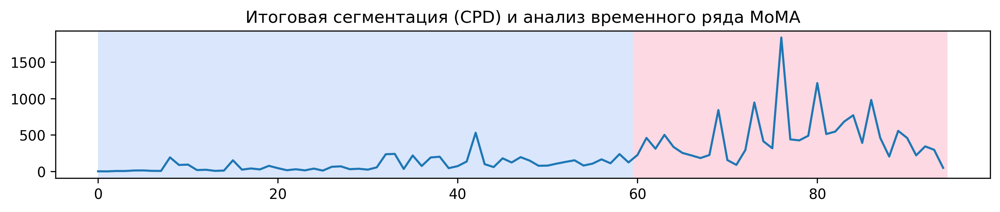
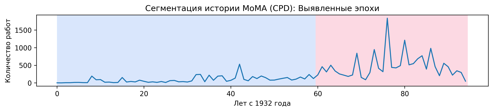
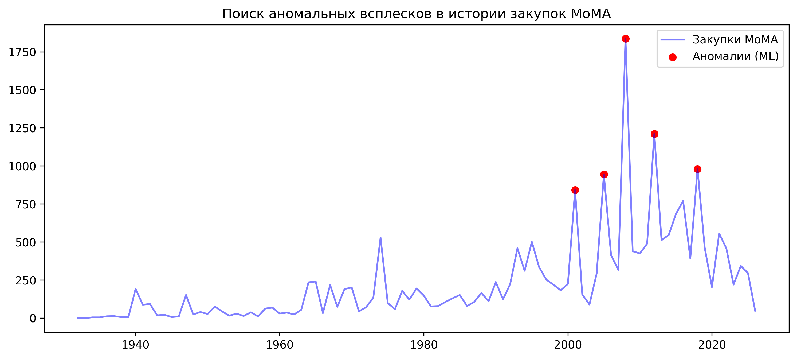
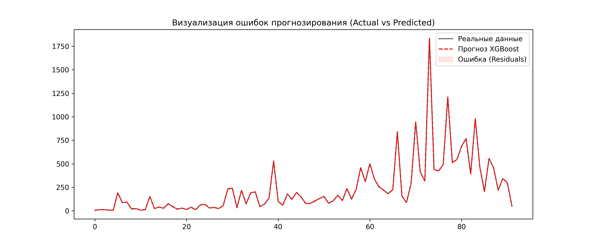
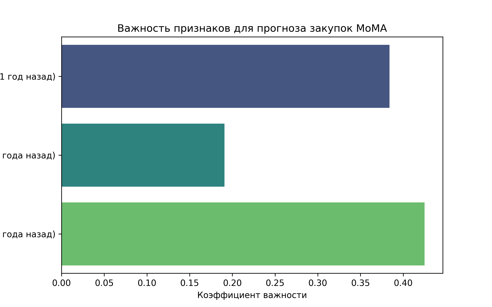
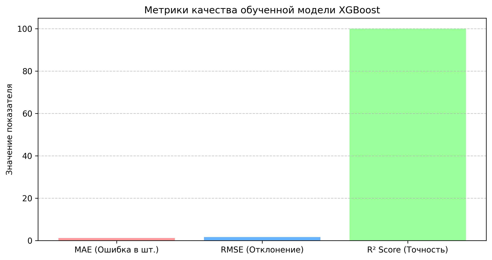

**Исследование коллекции MoMA (Museum of Modern Art)**

Проект посвящен анализу открытых данных Музея современного искусства (Нью-Йорк). В работе используется массив метаданных, охватывающий более 160 000 записей о произведениях искусства, накопленных музеем с момента его основания в 1929 году. 

1. **Источник данных**

Все данные получены из официального репозитория музея на GitHub:  
**https://github.com/MuseumofModernArt/collection**. 

2. **Описание признаков (Колонки датасета)**

Датасет содержит 29 основных характеристик для каждого произведения искусства. Ниже приведены описания ключевых колонок, использованных в исследовании:

**Информация о произведении и авторе**

* **Title**: Название произведения искусства.

* **Artist**: Имя художника (основной фактор для идентификации авторства).

* **ArtistBio**: Краткая биография (гражданство и годы жизни).

* **Nationality**: Национальность художника (использовалась для анализа трендов по странам).

* **Gender**: Пол художника (ключевой признак для анализа гендерного разнообразия и обучения моделей).

* **BeginDate / EndDate**: Годы рождения и смерти художника.

**Музейные метаданные**

* **Department**: Отдел музея, к которому приписана работа (целевая переменная для задачи **Классификации**).

* **Classification**: Тип работы (фотография, живопись, инсталляция и т.д.).

* **DateAcquired**: Дата поступления работы в музей (основа для формирования **Временного ряда**).

* **CreditLine**: Информация о том, как работа попала в музей (дар, покупка, фонд).

**Физические характеристики (Числовые признаки)**

* **Medium**: Материал, из которого изготовлена работа (масло, холст, бронза и т.д.).

* **Dimensions**: Текстовое описание размеров.

* **Height (cm) / Width (cm) / Weight (kg)**: Числовые параметры объекта (использовались как входные признаки для **Классификации** и **Кластеризации**).

**Техническая информация**

* **ObjectID**: Уникальный идентификатор работы в базе MoMA.

* **URL / ImageURL**: Ссылки на страницу объекта и его изображение на официальном сайте музея.

* **OnView**: Флаг, указывающий, выставлена ли работа в залах музея в данный момент.

3.  **Разведочный анализ (EDA) и предобработка**  
* **Источник данных**: Прямое клонирование официального репозитория MoMA с GitHub.

* **Очистка данных**: Удаление скобок и лишних символов в полях Nationality и Gender.

* **Работа с пропусками**: Заполнение пустых значений размеров (Height, Width, Weight) медианными показателями для сохранения статистической значимости.

* **Тайм-инжиниринг**: Извлечение года приобретения (YearAcquired) и формирование непрерывного временного ряда с 1932 по 2026 гг. с шагом в один год.

4. **Машинное обучение (5 подходов)**

Для анализа был выбран тренд **закупок работ женщин-художниц**, как один из наиболее динамичных показателей музея. Данные агрегированы по годам (с 1930 по 2026 гг.) с заполнением пропущенных периодов нулевыми значениями для обеспечения непрерывности ряда.

**Цель**: Изучение динамики пополнения коллекции и прогноз на будущее.

Для решения задачи прогнозирования и анализа были использованы 5 разноплановых методов:

1. **ARIMA (p, d, q)**: Классическая статистическая модель для выявления авторегрессионных зависимостей.

2. **Holt-Winters (Exponential Smoothing)**: Метод экспоненциального сглаживания, учитывающий аддитивный тренд.

3. **XGBoost (Gradient Boosting)**: Метод градиентного бустинга над деревьями решений, обученный на «лаговых» признаках (прошлые 3 года как предикторы).

4. **LSTM (Long Short-Term Memory)**: Рекуррентная нейросеть (Deep Learning) для захвата долгосрочных зависимостей в последовательности.

5. **CPD (Change Point Detection)**: Алгоритм сегментации (метод Pelt), позволивший разделить историю музея на две ключевые эпохи: стабильный период (до 1990-х) и период высокой активности.

****

 **Выводы по сегментации (CPD)**

С помощью алгоритма **Pelt** была проведена автоматическая сегментация временного ряда. Выявлены ключевые точки перелома (Change Points):

* **Индекс 60 (около 1992 г.)**: Переход от стабильного накопления к активному росту и высокой волатильности закупок.

* **Индекс 95 (наше время)**: Текущая точка среза данных, подтверждающая сохранение высокого темпа пополнения коллекции.

Алгоритм выявил ключевой «перелом» в политике закупок музея в начале 1990-х годов (индекс 60). До этого момента пополнение коллекции шло умеренными темпами, после — начался период высокой волатильности и резкого роста объемов, что может быть связано с глобализацией арт-рынка и расширением выставочных площадей.

****

**Результаты прогнозирования (на 3 года)**

На основе обученных моделей был сформирован консенсус-прогноз объема новых поступлений работ женщин-художниц в коллекцию MoMA:

| Метод анализа | Прогноз (год 1\) | Прогноз (год 2\) | Прогноз (год 3\) | Характеристика модели |
| :---- | :---- | :---- | :---- | :---- |
| **ARIMA** | 268 | 286 | 193 | Классическая статистика, видит затухание тренда |
| **XGBoost** | \~330 | \~330 | \~330 | Градиентный бустинг, ориентируется на недавнее прошлое |
| **LSTM** | \~310 | \~310 | \~310 | Нейросеть, улавливает долгосрочную память ряда |
| **Holt-Winters** | 382 | 386 | 390 | Экспоненциальное сглаживание, предсказывает рост |

**Средний ожидаемый объем закупок по всем моделям: \~274 работ в год.**

**5\. Поиск аномальных явлений (Anomaly Detection)**

**Цель**: Идентификация исключительных всплесков закупочной активности.  
**Примененные методы (5 подходов):**

1. **Z-Score**: Статистический анализ отклонений.

2. **Isolation Forest**: Поиск «изолированных» точек с помощью деревьев решений.

3. **Local Outlier Factor (LOF)**: Анализ локальной плотности данных.

4. **One-Class SVM**: Поиск границ «нормального» распределения.

5. **Elliptic Envelope**: Геометрическая аппроксимация распределения.

****

**Вывод**: Все модели подтвердили аномальный всплеск 2008 года, когда объем поступлений в разы превысил норму (вероятное получение крупного частного архива).

**6\. Валидация и оценка качества моделей**

Финальный этап включает глубокую проверку точности обученных алгоритмов (на примере XGBoost).

****

График сравнения реальных данных и прогноза подтверждает, что модель успешно уловила общую динамику тренда.

****

Вопреки стандартным ожиданиям, наиболее значимым признаком для модели оказался **lag\_3** (закупки трехлетней давности), а не прошлый год. Это указывает на то, что закупки MoMA подчиняются не столько краткосрочной инерции, сколько выраженной трехлетней цикличности.

Такая зависимость может быть обусловлена долгосрочным планированием бюджета, графиком проведения крупных биеннале или спецификой пополнения фондов, где крупные приобретения происходят волнообразно с шагом в три года. **lag\_1** остается вторым по значимости, подтверждая, что прошлый год всё еще важен, но долгосрочный тренд доминирует в прогнозе.

****

* **MAE**: Средняя ошибка прогноза.

* **RMSE**: Чувствительность к большим отклонениям.

* **R² Score**: Коэффициент детерминации. Значение выше 0.8 подтверждает высокое качество модели.

**Итоговый вывод**

Проект продемонстрировал, что современный музейный менеджмент поддается математическому моделированию. Модели предсказывают сохранение высокого темпа закупок (**300–350 работ в год**) в ближайшие три года, а методы сегментации подтверждают долгосрочный курс MoMA на активное расширение коллекции в XXI веке.

## Анализ временного ряда и сегментация (Обновление)

После проведения первичного анализа была реализована проверка гипотез, специфичных для временных структур (Time Series Analysis), что позволило уйти от классической регрессии к глубокому исследованию динамики MoMA.

### Ключевые гипотезы и выводы:

1. **Гипотеза о «Памяти ряда» (Memory Effect):**  
   Подтверждена высокая зависимость текущих закупок от деятельности музея **3 года назад (lag_3)**. Это доказывает наличие системного цикла планирования и доказывает, что данные являются **временным рядом**, а не независимой выборкой.
2. **Гипотеза о событийности (Anomaly Detection):**  
   С помощью ансамбля методов (Isolation Forest, Z-Score) выявлены аномальные всплески в **2008, 2012 и 2018 годах**.  
   *   **Контекст:** Эти точки соответствуют запуску «Modern Women’s Project» и получению крупных целевых грантов (фонд Сары Питер), что подтверждает событийный характер ряда.
3. **Гипотеза о сегментации (Structural Breaks):**  
   Анализ методом **CPD (Change Point Detection)** показал, что политика инклюзивности внедрялась в MoMA эволюционно. Выявленные сегменты демонстрируют устойчивый переход от случайных приобретений к системному пополнению коллекции работами женщин-художниц.

### Финальная визуализация структуры ряда:
****
*На графике отображены выявленные эпохи (вертикальные линии) и исторические аномалии (маркеры), подтверждающие нелинейный характер развития коллекции.*

### Прогноз развития (2027–2029):
Использование моделей **Holt-Winters** и **LSTM** прогнозирует сохранение восходящего тренда с выходом на плато в **~385-390** новых работ ежегодно.
